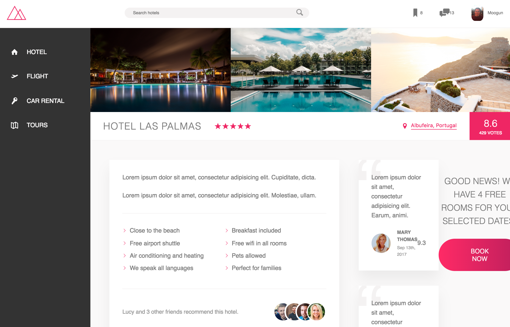

# Hotel Review Site Project written with CSS3 with SASS 



## How to test
1. clone or download this project
2. npm install && npm run build:css && npm run devserver
3. visit http://localhost:8080/

## Features
1. Flexbox for layout
2. Media Queries for responsiveness
3. SVG icons
```
<svg class="search__icon">
  <use xlink:href="img/sprite.svg#icon-magnifying-glass"></use>
</svg>
```
4. Used 'rem' for typogrpahy
```
html {
    font-size: 62.5%; // 1rem = 10px, 10px/16px = 62.5%
}
```
5. html5 tags
```
<figure class="review">
    <blockquote class="review__text">
        Lorem ipsum dolor sit amet, consectetur adipisicing elit. Fuga doloremque architecto dicta animi.
    </blockquote>
    <figcaption class="review__user">
        
        <div class="review__user-box">
            <p class="review__user-name">Mary Thomas</p>
            <p class="review__user-date">Sept 13th, 2017</p>
        </div>
        <div class="review__rating">9.3</div>
    </figcaption>
</figure>
```


## Dependencies
1. [node-sass](https://github.com/sass/node-sass): Compile .scss files to css
2. [autoprefixer](https://github.com/postcss/autoprefixer): Parse CSS and add vendor prefixes to CSS rules using values
3. [postcss-cli](https://github.com/postcss/postcss-cli): Together with autoprefixer, it lints CSS, support variables and mixins, transpile CSS syntax, and etc. inline images, and more.


## Credit
The design used in this repo was designed by [Jonas](https://github.com/jonasschmedtmann/advanced-css-course)
